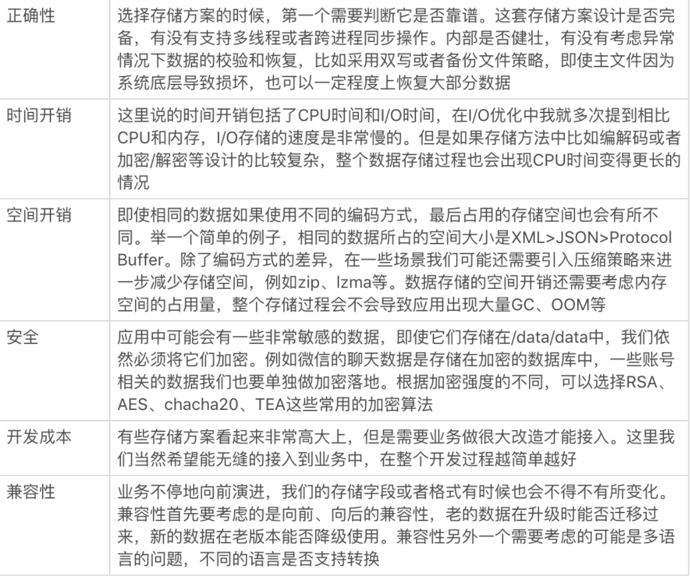
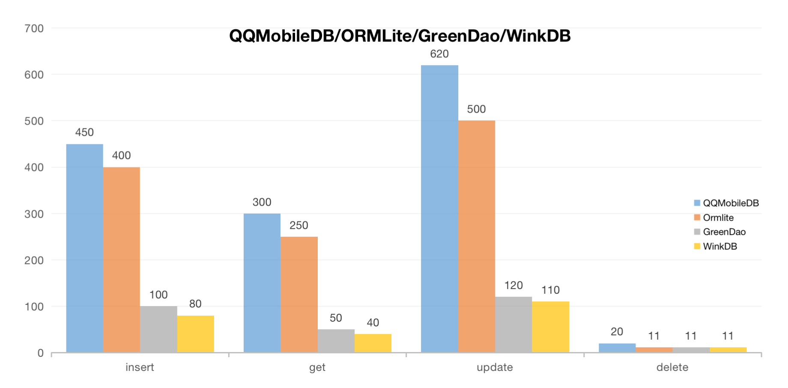
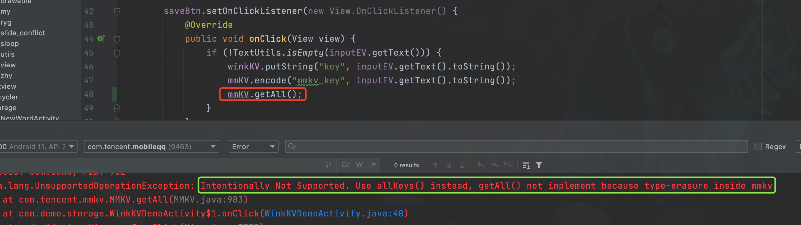
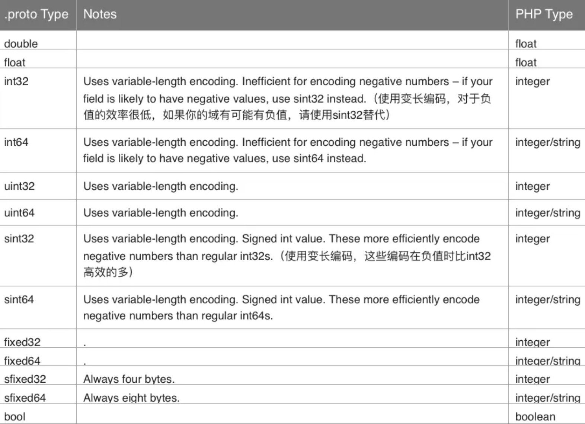

### wink存储相关指引


### 1 页面、网络性能优化

1.1 布局层次优化

层级数至少50%，待补充；


1.2 页面首次启动优化

页面首次启动速度提升，待补充；


1.3 网络性能优化

节能网络开销50%，待补充；


1.4 发布器启动优化

预加载进程、资源等，待补充；


### 2 存储优化


#### 2.1 DB性能标准




#### 2.2 DB方案对比


sqliter不足：，待补充；

greenDao不足：，待补充；


#### 2.2 WinkDB


2.2.1 原理


实现：基于ROOM的框架实现，

位置：com.tencent.mobileqq.wink.storage.db

架构：


Room Database：数据库

DAO：数据访问对象

Entities：数据表对象类


2.2.2 使用


1）创建业务Entities


```java
/**
 * 发布页数据类
 * <p>
 * Created by walkerzpli on 2021/8/10.
 */
@Entity(tableName = "wink_publish_content_table", indices = {@Index(value = {"missionId"}, unique = true)})
@TypeConverters({StringListTypeConverter.class, LocalMediaInfoMapTypeConverter.class, PoiInfoTypeConverter.class})
public class WinkPublishContent {

    @PrimaryKey(autoGenerate = true)
    @ColumnInfo(name = "id")
    public int id;

    @ColumnInfo(name = "uin")
    public long uin;
    
    @ColumnInfo(name = "missionId")
    public String mMissionId;

    @ColumnInfo(name = "selectedMedia")
    public List<String> mSelectedMedia;

    @ColumnInfo(name = "poiInfo")
    public LbsDataV2.PoiInfo mPoiInfo;

    // ...

    public WinkPublishContent() {
    }

}
```


2）创建DAO对象

```java

/**
 * DAO层，提供数据库访问接口
 * <p>
 * Created by walkerzpli on 2021/8/10.
 */
@Dao
public interface WinkPublishContentDao {

    @Insert(onConflict = OnConflictStrategy.REPLACE)
    void insert(WinkPublishContent content);

    @Query("DELETE FROM wink_publish_content_table WHERE uin = :uin AND missionId = :missionId")
    void deleteByMissionId(long uin, String missionId);

    @Update
    void update(WinkPublishContent publishContent);

    @Query("SELECT * FROM wink_publish_content_table ORDER BY createTime DESC")
    LiveData<List<WinkPublishContent>> getAllData();

}
```


3）创建Database

```java
/**
 * ROOM数据库统一创建类
 * <p>
 * Created by walkerzpli on 2021/8/10.
 */
@Database(entities = {WinkPublishContent.class}, version = 1, exportSchema = false)
public abstract class WinkRoomDatabase extends RoomDatabase {

    public abstract WinkPublishContentDao publishContentDao();
    private static volatile WinkRoomDatabase INSTANCE;

    static WinkRoomDatabase getDatabase(final Context context) {
        if (INSTANCE == null) {
            synchronized (WinkRoomDatabase.class) {
                if (INSTANCE == null) {
                    INSTANCE = Room.databaseBuilder(context,
                            WinkRoomDatabase.class, "wink_database")
                            .addCallback(sRoomDatabaseCallback)
                            .enableMultiInstanceInvalidation() // 使多实例失效，跨进程修改适用
                            .build();
                }
            }
        }
        return INSTANCE;
    }
}
```


##### 2.1.1 性能对比

QQMobileDB/ORMLite/GreenDao/WinkDB：




我们用图表来对比一下


sql语句的生成：

1）QQMobileDB/ORMLite：手Q数据库存储方案，由于在得到bind参数时使用反射，速度最慢

2）GreenDao：使用事先生成的代码进行bind，但是其生成sql语句是通过字符串拼接，会有一点时间损耗

3）WinkDB：而WinkDB则更彻底，sql语句会在编译时生成好。其性能最好


跨进程通信问题：待补充


#### 2.3 WinkKV


2.3.1 SP的不足

- **存储速度慢**

SP用内存层用HashMap保存，磁盘层则是用的XML文件保存。
 每次更改，都需要将整个HashMap序列化为XML格式的报文然后整个写入文件。
 归结其较慢的原因：
1）不能增量写入；
2）序列化比较耗时。

- **有ANR风险**

Activity stop时会等待SP的任务写入完成，如果SP的写入任务多且执行慢的话，可能会阻塞主线程较长时间，重则ANR。数据损坏率大约在万分之一。


2.3.2 MMKV的不足

- **没有类型信息，不支持getAll** 
  MMKV的存储用类似于Protobuf的编码方式，只存储key和value本身，缺乏自描述。

MMKV.java

```java
public Map<String, ?> getAll() {
	throw new UnsupportedOperationException("Intentionally Not Supported. Use allKeys() instead, getAll() not implement because type-erasure inside mmkv");
}
```





- **读取相对较慢** 
  SP在加载时将value反序列化到内存中，读时直接索引。 
  而MMKV每次读取时都需要重新解码，每次都创建新的对象。 




- **需要引入so, 增加包体积** 
  引入MMKV需要增加的体积还是不少的，且不说jar包和aidl文件，光是一个arm64-v8a的so就有四百多K。


- **文件只增不减**
  MMKV的扩容策略还是比较激进的，而且扩容之后不会主动trim size。
  比方说，假如有一个大value，让其扩容至1M，后面删除该value，哪怕有效内容只剩几K，文件大小还是保持在1M。


- **可能会丢失数据**
  前面的问题总的来说都不是什么“要紧”的问题，但是这个丢失数据确实是硬伤。
  MMKV官方有这么一段表述：


### 2.1 特性

WinkKV有以下特性：

1. 读写速度快
   - WinkKV采用二进制编码，编码后的大小较json等方式要小许多。
   - 增量编码：WinkKV记录了各个key-value相对文件的偏移量，操作数据时，只需在对应的地方插入即可。
   - 默认用mmap的方式操作data，更新数据直接访问内存，不阻塞IO。
2. 支持多种写入模式
   - 除了mmap，WinkKV也支持一般的blocking方式， 并且支持同步阻塞和异步阻塞（分别类似于SharePreferences的commit和apply)。
3. 支持多种类型
   - 支持常用的boolean/int/float/long/double/String等基础类型。
   - 支持ByteArray (byte[])。
   - 支持存储自定义对象。
   - 内置StringSet编码器 (为了兼容SharePreferences)。
4. 方便易用
   - WinkKV提供了了丰富的API接口，开箱即用。
   - 提供的接口其中包括getAll()和putAll()方法， 所以迁移SharePreferences等框架的数据到WinkKV很方便，当然，迁移WinkKV的数据到其他框架也很方便。
5. 代码精简
   - WinkKV由纯Java实现，编译成jar包后体积只有几十K。


500条数据测试结果：

|                  | 写入(ms) | 读取(ms) |
| ---------------- | -------- | -------- |
| SharePreferences | 1182     | 2        |
| DataStore        | 33277    | 2        |
| MMKV             | 29       | 10       |
| WinkKV           | 19       | 1        |

- SharePreferences提交用的是apply, 耗时依然不少。
- DataStore的写入很慢。
- MMKV的读取比SharePreferences/DataStore要慢一些，写入则比之快许多。
- WinkKV无论读取还是写入都比其他方式要快。


### 2.2 实现原理


#### 2.2.1 编码


文件的结构：

> [data_len | checksum | key-value | key-value｜....]


- data_len: 占4字节, 记录所有key-value所占字节数。
- checksum: 占8字节，记录key-value部分的checksum。


key-value的数据布局：

```
+-+-+-+-+-+-+-+-+-+-+-+-+-+-+-+-+-+-+-+-+-+-+-+-+-+-+-+-+-+-+-+-+-+-+-+-+
| delete_flag | external_flag | type  | key_len | key_content |  value  |
+-+-+-+-+-+-+-+-+-+-+-+-+-+-+-+-+-+-+-+-+-+-+-+-+-+-+-+-+-+-+-+-+-+-+-+-+
|     1bit    |      1bit     | 6bits |  1 byte |             |         |
```


- delete_flag ：标记当前key是否删除；

- external_flag：标记value是否要另存文件；

- type: value类型，支持基础类型以及自定义类型；

- key_len: 记录key的长度，key_len本身占1字节；

- key_content：key的内容本身，utf8编码；

- value：对于基础类型的value，直接小端编码； 
   其他类型，先记录长度（用varint编码），再记录内容。 


#### 2.2.2 存储


- mmap
   WinkKV采用mmap为主的方式写入。 
- 降级
  当mmap API发生IO异常时，降级到常规的blocking I/O，同时放到异步线程中处理。
- 更新策略（增/删/改）
   新增：插入到数据的未尾。 
   删除：delete_flag标记为1。 
   修改：value长度和原来一样时，写入原来的pos； 否则，先写入key-value到数据未，然后标记原来pos的delete_flag为1（删除），最后同步的data_len和checksum。
- gc/truncate
   删除key-value时会收集信息（统计删除的个数，以及所在位置，占用空间等）。 
   GC的触发时机:
   1、新增key-value时空间不足，且已删除标记的空间，不足再扩容； 
   2、删除key-value时，如果删除空间达到阈值，或者删除的key-value个数达到阈值，则触发GC。 
   GC后如果空闲的空间到达一定值，则触发truncate（缩小文件大小）。


#### 2.2.3 性能对比


改进点：

1）FlatBuffers；

2）支持跨进程；

3）mmap API发生IO异常时，需要降级到blocking I/O。


排期：

（1）【8855】【【小世界】个人主页作品合集功能】 http://tapd.oa.com/androidQQ/prong/stories/view/1010066461869113629

https://doc.weixin.qq.com/sheet/e3_m_YpgimmLZmdhJ?scode=AJEAIQdfAAo539LRFhAFoAggbdAFw&tab=yuakx2

（2）【8860】【话题挑战—浮层承接（热门话题榜单及聚合浮层）】 http://tapd.oa.com/androidQQ/prong/stories/view/1010066461869554691


https://doc.weixin.qq.com/sheet/e3_m_YpgimmLZmdhJ?scode=AJEAIQdfAAo539LRFhAFoAggbdAFw&tab=yzccsc

（3）【8850-8860】【【技术需求】【发布器】草稿箱存储方式优化】 http://tapd.oa.com/androidQQ/prong/stories/view/1010066461867070597


频道需求：


【【8833】【QQ频道】文字子频道权限】 http://tapd.oa.com/androidQQ/prong/stories/view/1010066461868298473

【【8833】【QQ频道】频道身份组关联权限】 http://tapd.oa.com/androidQQ/prong/stories/view/1010066461868326493


