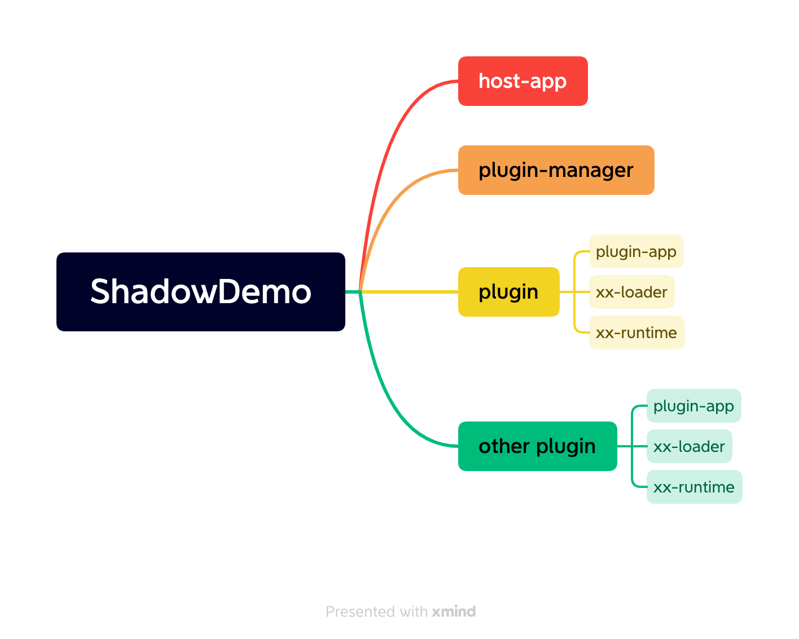

Shadow插件化框架接入说明：

1）host-app：为宿主APP，即我扪的主工程APP；

2）plugin-manager：在主工程中创建的模块，用于管理、启动插件apk；

3）plugin：为插件apk部分内容，需包括以下模块：

- plugin-app：插件APP，可以正常打出apk包；
- xx-loader：插件loader模块；
- xx-runtime：插件runtime模块；

4）other plugin：为其它插件。

